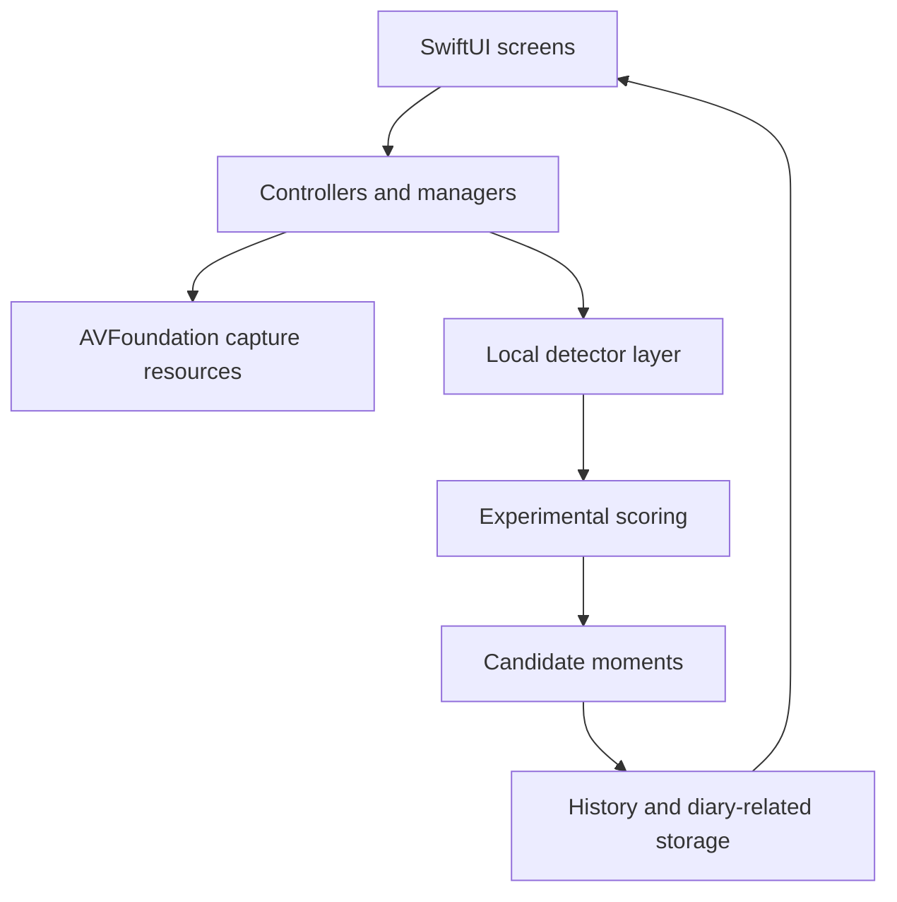
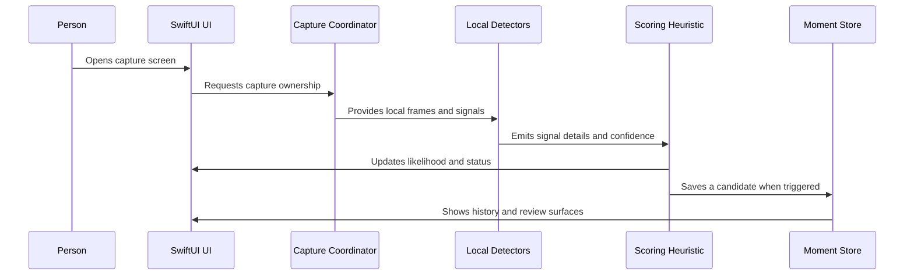

# Architecture

This page explains the main parts of Clipify without publishing the complete app source code.

## App layers

## Capture pipeline

Clipify uses an AVFoundation camera and audio pipeline. A capture coordinator gives one controller ownership of the shared camera resources so multiple scenes or overlays do not try to start and stop the same session at once.

A simplified flow is:

1. The interface asks capture to start, pause, or hand off.
2. The coordinator manages the shared camera and audio resources.
3. Camera, motion, sound, and other local signals update detector state.
4. Detector output becomes a structured snapshot.
5. The scoring layer can surface a candidate moment.
6. The user can review, ignore, or keep the result.

## Local signals

The private app experiments with signals such as face presence, sound, voice, scene, objects, activity, motion, place, weather, and emotion-related metadata. These are treated as indicators, not as complete understanding of a person or event.

The selected detector registry sample shows the orchestration pattern without including the full detector implementations, models, media, or real signal histories.

## Candidate moments

A candidate moment can contain:

- a timestamp
- a profile or context name
- an experimental likelihood score
- a signal snapshot
- optional inferred activities
- optional episode information
- a reference to saved media when the user keeps it

A candidate means “this may be worth reviewing.” It does not mean the app has decided that the moment is important.

## Storage and sync

Clipify stores moment and history information locally and also contains CloudKit-related synchronization work. The exact database models, containers, account configuration, and complete sync implementation are not included here.

I do not claim that every piece of data always stays only on the device. Sync behavior and user-facing privacy controls are still part of the product work before an App Store release.

## Interface surfaces

The app includes screens for:

- camera and capture controls
- settings and profile controls
- signal and diagnostic views
- key-moment history
- episode history
- diary or reflection flows

## Privacy boundaries in this showcase

This repository does not include:

- the complete source tree
- bundle, team, CloudKit, or developer identifiers
- certificates, provisioning profiles, secrets, or tokens
- local databases, logs, user profiles, or analytics exports
- captured photos, videos, audio, faces, locations, or personal memories
- raw detector histories from real use

## Simplified sequence

