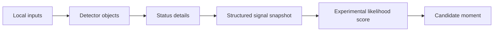

# Signal Pipeline

Clipify explores how raw inputs can become structured candidate moments. The app should not be described as knowing what a person feels or what a moment means.

## Inputs

The development project experiments with:

- camera frames through AVFoundation
- motion and activity signals
- scene, object, and face-presence signals
- sound and voice-related signals
- place and weather context
- emotion-related experimental metadata

Some of these signals can be sensitive, so this showcase does not include real detector histories or output from personal use.

## From input to candidate

## Filtering and confidence

Detector output is uncertain. A confidence value describes the detector result, not whether the app understood the situation correctly.

For example, the app can say:

- a scene signal changed
- an activity signal had higher confidence
- the score suggested a moment might be worth reviewing
- a candidate moment was created

It should not turn those results into a statement about what the person feels or why the moment matters.

## Moment creation

A candidate can be created when the user captures directly or when the experimental score crosses a configured threshold. The candidate can include score values and a signal snapshot so the result can be reviewed later.

## Episode and diary flow

The app also experiments with grouping nearby key moments into episodes and using those episodes in diary or reflection surfaces. These results are still candidates for review, not a finished interpretation of the day.

## What the system does not claim

Clipify does not claim to:

- understand a person’s life
- reliably identify an internal emotional state
- record everything
- decide what is meaningful for the user
- replace human interpretation

The app surfaces possible moments from signals so the person can decide what to keep.
